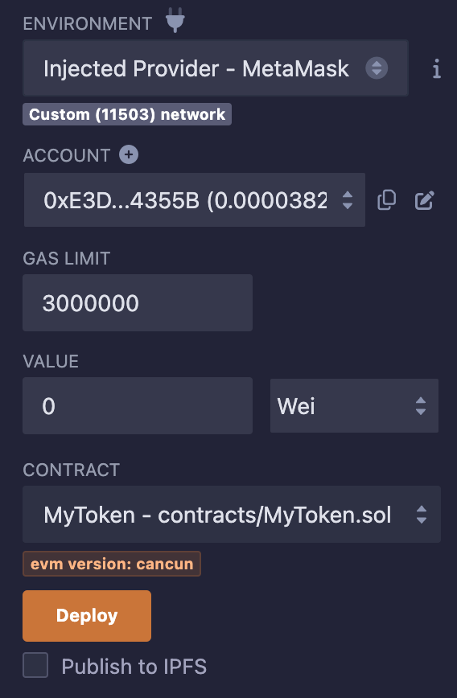

# Deploy Smart Contract on SatsChain Mainnet

Finally, it's time to deploy your first smart contract on SatsChain Mainnet! In this tutorial, you will deploy a basic ERC20 token using Remix.

## Preparation of Solidity Smart Contract on Remix​

Visit [Remix](https://remix.ethereum.org/) and you can choose the ERC20 Template from openZeppelin, and modify MyToken.sol.

```
// SPDX-License-Identifier: MIT
pragma solidity ^0.8.20;

import "@openzeppelin/contracts/token/ERC20/ERC20.sol";
import "@openzeppelin/contracts/token/ERC20/extensions/ERC20Permit.sol";

contract MyToken is ERC20, ERC20Permit {
    constructor() ERC20("SatsChain", "SatsChain") ERC20Permit("SatsChain") {
        _mint(msg.sender, 1000 * 10 ** 18);
    }
}
```
This smart contract is designed to deploy an ERC20 token named 'SatsChain' with the ticker 'SatsChain' and a total supply of 1000, utilizing 18 decimals for precision. To compile this contract, navigate to the Solidity Compiler tab in Remix. 

Subsequently, proceed to the Deploy and Run Transactions tab, adjusting the environment to Injected Web3. Confirm the presence of the Custom (11503) network in the environment field; if not visible, access and modify your network settings through MetaMask. Your interface should now resemble the illustration below:



## Deploy Contract on SatsChain Mainnet

Proceed by clicking on the 'Deploy' button. A prompt from MetaMask will appear, at which point you should select the 'Confirm' button. 

You have successfully deployed your inaugural smart contract on the SatsChain Mainnet! To confirm this, you will notice the EVM events displayed within the explorer.

## View your New Token within MetaMask​
This token can be added to MetaMask because the contract is fully ERC20 compatible, and you will find the ERC20 contract address on Remix or Explorer. 

In this case, the contract address is "0x73a2FdC366BC339241d685a8B4A0de09a094706b". With that, you can open MetaMask, click the Add Token button, and input your contract address in the Token Contract Address field. 

You will see that the Token Symbol and Token Decimal fields are filled in automatically, and at last, click Next, and then Add Tokens buttons.

You should now see your newly minted ERC20 tokens that are deployed on SatsChain Mainnet, right within your MetaMask, and be able to transfer them to any other EVM account.