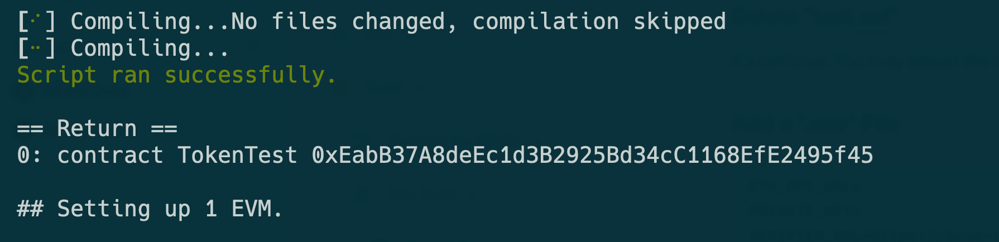

# Foundry
Foundry is a key part of the EVM development tools, made by Paradigm, to help developers create and test EVM applications efficiently. It features tools for constructing contracts, interacting with the blockchain, and testing on a simulated network. It emphasizes testing to make sure the code is solid before it goes live. Foundry also speeds up the development process with fast feedback and simulates the blockchain to save on costs. In short, it's a valuable tool for developers making smart contracts on EVM.

## Download Rust Toolkit
The Foundry toolkit, which is developed using the Rust programming language, necessitates the prior installation of the Rust toolkit in order to be downloaded and used effectively.
```
curl --proto '=https' --tlsv1.2 -sSf https://sh.rustup.rs | sh
```
Choose the default installation, and click "enter", until you can activate your environment at last.
```
source $HOME/.cargo/env
```
Check your Rust version 
```
rustc --version
```

## Download Foundry Toolkit
```
cargo install --git https://github.com/gakonst/foundry --bin forge --locked

```




